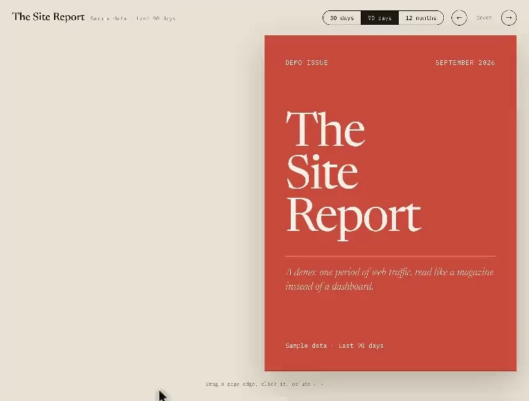

# OpenPageFlip

Maintained successors to [StPageFlip](https://github.com/Nodlik/StPageFlip) and [react-pageflip](https://github.com/Nodlik/react-pageflip): the same page-turn effect, rebuilt for 2026 browsers, strict TypeScript and React 19.

| Package | npm | What it is |
| --- | --- | --- |
| [`@openpageflip/core`](packages/core) |  | Framework-agnostic engine. ESM plus an IIFE build for `<script>` tags. |
| [`@openpageflip/react`](packages/react) |  | React 19 bindings. |

Docs, live demos, the API reference and changelogs: <!-- homepage -->**[openpageflip.shittylittleapps.com](https://openpageflip.shittylittleapps.com)**<!-- /homepage --> (built from [`apps/docs`](apps/docs)).

Both packages are pre-1.0 and under active construction. [`SPEC.md`](SPEC.md) has the plan, the decisions behind it, and what is still open.

## Features

### From StPageFlip and react-pageflip

The page turn itself is StPageFlip's, right down to the fold geometry, and the test suite holds ours to the original pixel for pixel. So what it did, this still does:

- Soft pages that curl along the fold, and hard pages (covers, boards) that swing as one stiff sheet
- Turn a page by dragging it, clicking it, or swiping on a touch screen
- Shadows that move with the fold
- A two-page spread that drops to one page when the container gets narrow
- A fixed size, or stretch to fill the container
- Covers, where the first and last pages stand alone
- Pages are plain HTML, so whatever's on them keeps working
- Methods to flip or jump to a page, and events for when it happens
- A React component where every child is a page (that part is react-pageflip's)

### New in OpenPageFlip

Most of these come straight out of the issues people filed on the original repos over the years:

- Four bindings: left, right-to-left (manga style), and top or bottom for a notepad or wall calendar
- `layout: "single"` keeps the book on one page at a time, whatever the width
- Hovering a page's edge furls it, and clicks and drags start from that same edge, so the middle of the page stays yours for selecting text and clicking links
- A `flipProgress` event every frame, for moving your own things in step with a turn
- `flipNext`, `flipPrev` and `flipTo` return a promise that resolves when the page lands
- Pages can be swapped without rebuilding the book, and in React props and children can change without a remount
- Safe to server-render - nothing touches `window` at import
- Pointer Events and `touch-action`, so the page around the book still scrolls on a phone
- Respects `prefers-reduced-motion`
- Works inside a container you've scaled or zoomed with CSS
- `destroy()` stops the frame loop and hands your DOM back the way it found it
- Frames are only drawn when something moves, so an idle book costs nothing
- Strict TypeScript types in the package, and React 19 bindings

A handful of things behave differently from the original on purpose. [`SPEC.md`](SPEC.md) lists them with the reasons, and the migration guide on the docs site maps every old option and method to its new name.

## Working on it

Requires [Bun](https://bun.com) 1.4+ and [Task](https://taskfile.dev). `task --list` shows every command; `task install` then `task check` runs what CI runs. [`CONTRIBUTING.md`](CONTRIBUTING.md) has the rest.

## License

MIT. The page-fold geometry derives from Oleg Litovski's StPageFlip, also MIT.
